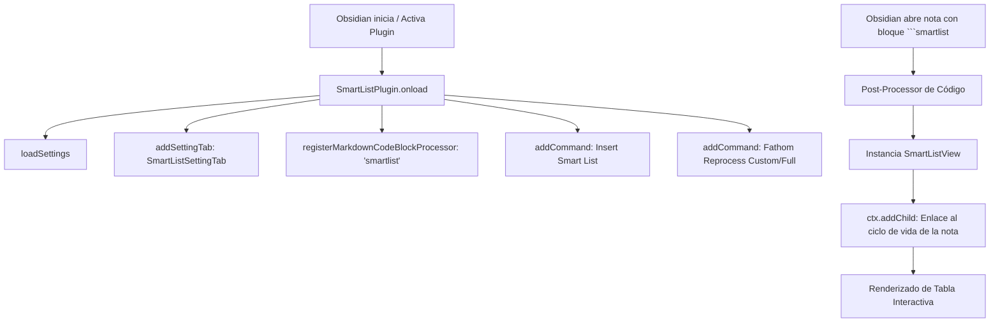

# Arquitectura del Plugin - Obsidian Smart Lists

## 1. Visión General y Stack Tecnológico

**Obsidian Smart Lists** es un plugin desarrollado para el ecosistema [Obsidian](https://obsidian.md/) que transforma bloques de datos JSON estructurados en bases de datos interactivas con interfaz visual enriquecida (estilo Notion o Airtable). El plugin permite visualizar, editar, filtrar, ordenar y relacionar datos directamente dentro de notas Markdown sin requerir bases de datos externas ni romper la portabilidad de los archivos.

### Componentes Tecnológicos
- **Lenguaje Base:** TypeScript con tipado estricto.
- **Compilador / Bundler:** `esbuild` con script de empaquetado optimizado para Obsidian (`esbuild.config.mjs`).
- **Plataforma:** Obsidian API (`obsidian`), compatible tanto con Obsidian Desktop como con Obsidian Mobile.
- **Motor de Renderizado:** Manipulación programática directa del DOM de Obsidian mediante CSS estructurado en `display: table` sin elementos `<table>` nativos.

---

## 2. Estructura del Código Fuente

```text
c:\Programacion\Github\Add-on Obsidian\
├── docs/                        # Documentación técnica y guías operativas
│   ├── arquitectura.md          # Diseño técnico y arquitectura interna (este documento)
│   ├── guia_usuario.md          # Manual de usuario y funcionalidades interactivas
│   └── decisiones.md            # Registro de Decisiones de Arquitectura (ADR)
├── src/
│   ├── main.ts                  # Punto de entrada del plugin (ciclo de vida y comandos)
│   ├── settings.ts              # Pestaña de configuración global del plugin
│   ├── smart-list.view.ts       # Controlador de vista de bloque (MarkdownRenderChild)
│   ├── models/                  # Interfaces y definiciones de tipos
│   │   ├── types.ts             # Definiciones de ColumnType, RowData, SmartListData, UIState
│   │   └── defaults.ts          # Plantilla por defecto de tabla inicial
│   ├── renderers/               # Componentes de renderizado visual
│   │   ├── table.renderer.ts    # Orquestador del contenedor, toolbar y scroll responsivo
│   │   ├── header.renderer.ts   # Cabeceras con iconos, menús contextuales y filtros
│   │   └── cell.renderer.ts     # Renderizadores especializados para los 9 tipos de celda
│   ├── services/                # Capa de servicios y lógica de datos
│   │   ├── data.service.ts      # Serialización y parseo seguro de JSON
│   │   ├── person.service.ts    # Integración con contacts.md y autocompletado de personas
│   │   └── fathom.service.ts    # Cliente HTTP para integración con backend de Fathom
│   └── utils/                   # Utilidades puras
│       ├── clipboard.utils.ts   # Exportación a portapapeles dual (HTML con estilos inline y TSV)
│       ├── dnd.utils.ts         # Drag and Drop nativo de filas y columnas
│       ├── dom.utils.ts         # Manipulación y creación de nodos DOM
│       ├── dropdown.utils.ts    # Menús desplegables contextuales
│       └── id.utils.ts          # Generador de identificadores únicos
├── styles.css                   # Hoja de estilos desacoplada (variables de tema de Obsidian)
└── manifest.json                # Metadatos del plugin para Obsidian
```

---

## 3. Ciclo de Vida y Extensión de Obsidian

El plugin interactúa con el core de Obsidian a través de la clase `SmartListPlugin` en `src/main.ts`:



### Registro del Bloque de Código
Mediante `registerMarkdownCodeBlockProcessor('smartlist', ...)`, Obsidian delega en el plugin el renderizado de cualquier bloque Markdown cercado con el identificador `smartlist`. El post-procesador crea una instancia de `SmartListView`, la cual se registra como un `MarkdownRenderChild` dentro del contexto (`ctx.addChild`). Esto asegura que cuando la nota se cierre o se desplace fuera de la vista, los event listeners y recursos DOM se liberen limpiamente.

---

## 4. Arquitectura de Interfaz: CSS Puro sin Tags `<table>`

Uno de los mayores desafíos de construir plugins visuales de tablas en Obsidian es la interferencia con otros plugins populares (como *Advanced Tables*, plugins de fórmulas LaTeX o temas visuales agresivos). La mayoría de estos plugins aplican selectores globales sobre las etiquetas HTML `table`, `thead`, `tbody`, `tr` y `td`.

Para garantizar **inmunidad total ante conflictos**:
- La tabla de Smart Lists **no utiliza etiquetas `<table>` nativas**.
- Se implementa una jerarquía basada puramente en `div` estilizados con propiedades CSS de tabla:
  - Contenedor: `display: flex; flex-direction: column;`
  - Contenedor de tabla: `display: table;`
  - Fila de cabecera / datos: `display: table-row;`
  - Celdas: `display: table-cell;`
- Esto otorga libertad absoluta para manejar z-index de menús flotantes, dropdowns absolutos, modales de color, animaciones de drag & drop y layouts responsive sin que ningún tema externo corrompa el espaciado ni oculte el contenido.

---

## 5. Renderizado Modular

### 5.1. TableRenderer (`src/renderers/table.renderer.ts`)
Orquesta el montaje del contenedor general:
- **Barra de Herramientas Superior:** Muestra el título de la tabla (editable con doble clic), contador de filas visibles vs totales, botones de acción (copiar al portapapeles, sincronizar con Fathom, reprocesar reunión) y botón para guardar la vista actual como predeterminada (`defaultUIState`).
- **Cuerpo de Tabla:** Controla el scroll horizontal suave para tablas anchas y el botón inferior `+ Nueva Fila`.

### 5.2. HeaderRenderer (`src/renderers/header.renderer.ts`)
Renderiza las cabeceras de columna:
- **Icono de Tipo:** Muestra un SVG específico para cada tipo de columna (`text`, `number`, `select`, etc.).
- **Reordenación por Arrastre (DND):** Maneta de arrastre que permite reposicionar columnas en tiempo real.
- **Menú de Opciones de Columna:** Permite renombrar, cambiar el tipo de datos o eliminar la columna.
- **Filtro Dinámico:** Abre un dropdown contextual con barra de búsqueda y lista de checkboxes de valores únicos presentes en la columna.
- **Ordenación:** Alterna entre orden ascendente, descendente y sin orden al hacer clic en el encabezado.

### 5.3. CellRenderer (`src/renderers/cell.renderer.ts`)
Encargado del renderizado y edición de celdas para los **9 tipos de datos**:
1. **Text (`text`):** Input editable directo con ajuste automático de ancho.
2. **Number (`number`):** Campo numérico con validación y alineación tipográfica.
3. **Select (`select`):** Dropdown con etiquetas estilizadas en pastillas de color (pills) seleccionables de una paleta predeterminada (`DEFAULT_SELECT_COLORS`).
4. **Multi-Select (`multiselect`):** Colección de pastillas de colores que pueden combinarse libremente en una misma celda.
5. **Date (`date`):** Selector de fecha interactivo almacenado en formato estándar `YYYY-MM-DD`.
6. **Checkbox (`checkbox`):** Casilla de verificación booleana interactiva de un clic.
7. **Person (`person`):** Celda de contacto conectada al directorio de personas (`PersonService`). Muestra un pill con el nombre y un tooltip con la dirección de correo si está disponible.
8. **Url (`url`):** Enlace web clicable con botón de edición rápida.
9. **Lookup (`lookup`):** Campo relacional que consulta valores de otra tabla Smart List alojada en cualquier nota de la bóveda (`getLookupValues`).

---

## 6. Servicios y Capa de Datos

### 6.1. Persistencia Segura (`DataService`)
Toda la información se almacena en el propio bloque Markdown en formato JSON:
```json
{
  "title": "Plan de Acción",
  "columns": [...],
  "rows": [...],
  "defaultUIState": {
    "sortConfig": { "columnId": "due_date", "dir": "asc" },
    "filters": { "status": ["Pendiente", "En Curso"] }
  }
}
```
Al editar cualquier celda o reordenar filas, `DataService` serializa el objeto con formato de 2 espacios y actualiza el archivo en Obsidian mediante la API de Vault, preservando la idempotencia y la compatibilidad con sistemas de control de versiones como Git.

### 6.2. Directorio de Contactos (`PersonService`)
Resuelve los participantes disponibles para el autocompletado en columnas de tipo `Person`:
1. **Fuente de Verdad (`contacts.md`):** Lee el archivo centralizado en la bóveda, agrupado por encabezados `## [EMPRESA]` y tablas Markdown.
2. **Detección Automática de Empresa:** Extrae el cliente evaluando la ruta del archivo actual (ej: `CLIENTES/MARTIDERM/PDA MARTIDERM.md` -> detecta `MARTIDERM`).
3. **Contactos Internos:** Incluye automáticamente los contactos de la empresa consultora (`MESBOOK`) para permitir asignar responsables tanto del cliente como del equipo interno.
4. **Fallback Heurístico:** Si no existe `contacts.md`, escanea los archivos `metadata.json` de reuniones de Fathom en el directorio local y extrae los participantes registrados.

### 6.3. Integración con Fathom Notebook (`FathomService`)
- Detecta si la nota activa es un PDA global o unas minutas de sesión de Fathom.
- Realiza peticiones HTTP al backend local (`http://localhost:3000`) para sincronizar cambios o lanzar el modal de reprocesamiento.
- Muestra el progreso y resultado de las operaciones mediante notificaciones nativas de Obsidian (`Notice`).

---

## 7. Portapapeles Enriquecido (`ClipboardUtils`)

Para facilitar el flujo de trabajo corporativo (reportes de estado por correo o minutas para clientes), el botón de copia al portapapeles genera un payload binario compuesto:
- **Texto Plano (TSV):** Tab-Separated Values, ideal para pegar en Excel, Google Sheets o editores de texto.
- **HTML con Estilos Inline:** Tabla HTML completamente formateada con estilos CSS incrustados en cada etiqueta (`style="background-color: ...; border-radius: 4px; ..."`).
- Al pegarlo en **Microsoft Outlook**, **Microsoft Word** o **Google Gmail**, la tabla mantiene exactamente los mismos colores de fondo, bordes, tipografía y pastillas de estado que en Obsidian.
- **Filtros Respetados:** Si la tabla tiene filtros activos, solo se exportan las filas visibles en pantalla.
